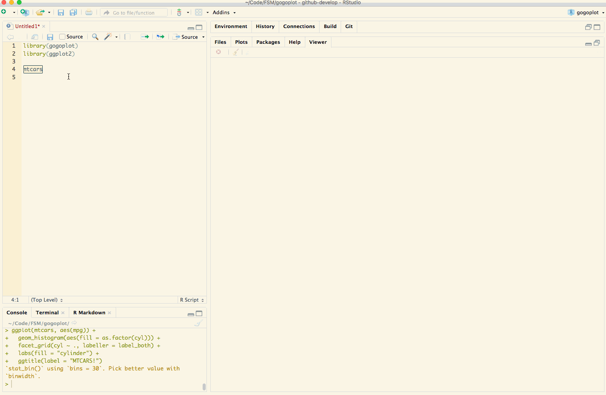

gogoplot
========

`gogoplot` provides a simple GUI for building a [`ggplot`](http://ggplot2.tidyverse.org) data visualization (using a [`shiny` HTML gadget](https://shiny.rstudio.com/articles/gadgets.html)). A data viz GUI is nothing new thing. What `gogoplot` aims to do is to dynamically build and return the *code* used to make a visualization, which makes it reproducible. This is also meant as an education tool to help introduce folks to some of the core functionality, syntax, and concepts of `ggplot2`.

This package is a work in progress. I would love help improving it! Check out the "**Contribute**" section if you're interested.

<br>

Install
-------

`gogoplot` is only currently only available on github, as a development version. You can install this with the code below, using the `devtools` package.

``` r
# install.packages("devtools")
devtools::install_github("wcmbishop/gogoplot", force = TRUE)
```

<br>

Example
-------

The current version of `gogoplot` has just one function - `gogoplot()`. When you pass in a data-frame, a gadget UI will appear (either in your RStudio Viewer pane or in a pop-up window). From there, you can interactively build up a visualization. At any point you can show the `ggplot2` code that is being generated, and when you're finished you can return that code. If you're using RStudio, the generated plot code is automatically inserted wherever your cursor is located.

``` r
library(ggplot2)
library(gogoplot)
gogoplot(mtcars)
```



### RStudio Addin

The package also installs a handy **RStudio IDE add-in**, available in the "Addins" drop-down. To use this, highlight a data-frame object in your code and select the `gogoplot` add-in to run the gadget.

<br>

Contribute
----------

This is the very beginning of this package, and I would love help and feedback in developing it. The core concept is to provide simple GUIs for common R activities, which can then return the generated code as a result. As mentioned above, this seems useful both as a learning tool and a way to generate reproducible code. I'd ideally like to build these GoGo gadgets for some of the most valuable and frequently used [`tidyverse`](https://www.tidyverse.org) tools/workflows below. I'm starting with `ggplot2` because it's what got me into R.

-   plotting with [`ggplot2`](http://ggplot2.tidyverse.org)
-   data manipulation with [`dplyr`](http://dplyr.tidyverse.org)
-   data tidying with [`tidyr`](http://tidyr.tidyverse.org)

The core piece to making these gadgets robust and scalable is to implement the programmatic code generation well. This has recently been improved to capture both plot updates and plot code in one step, with a new `%++%` operator. This function adds a plot layer and captures the code in an object attribute (as a character vector). This relies heavily on the amazing [rlang](http://rlang.tidyverse.org) package and [quasiquotation](http://dplyr.tidyverse.org/articles/programming.html#quasiquotation) under the hood.

If you would like to help, please post a new github issue or send me a pull-request.
