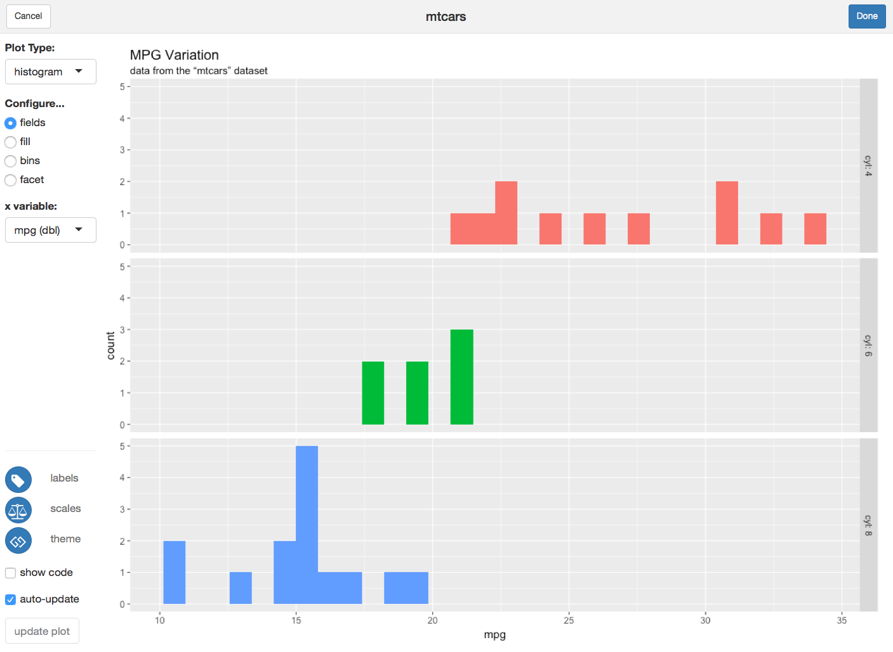

gogoplot
========

`gogoplot` provides a simple GUI for building a [`ggplot`](http://ggplot2.tidyverse.org) data visualization (using a [`shiny` HTML gadget](https://shiny.rstudio.com/articles/gadgets.html)). A data viz GUI is not a new thing. But the feature that `gogoplot` strives to achieve is the ability to return *either* the final plot *or* the code used to make that plot. This makes `gogoplot` an educational tool and a way to make your visualizations reproducible.

This package is a work in progress. I would love help improving it! Check out the "*Contribute*" section if you're interested.

<br>

Install
-------

You can install the latest dev version of `gogoplot` directly from BitBucket by running the code below:

    devtools::install_git(url = "https://stash.teslamotors.com/scm/fsm/gogoplot.git", branch = 'develop')

<br>

Example
-------

The current version of `gogoplot` has just one function - `gogoplot()`. When you pass in a data-frame, a gadget UI will appear (either in your RStudio Viewer pane or in a pop-up window). From there, you can get to plotting! At the end, return the plot you made or the code needed to make it yourself.

``` r
library(gogoplot)
gogoplot(mtcars)
```



<br>

Contribute
----------

This is the very beginning of this package, and I would love help and feedback in developing it. The core concept is to provide simple GUIs for common R activities, which can then return the generated code as a result. As mentioned above, this seems useful both as a learning tool and a way to generate reproducible code. I'd ideally like to build these GoGo gadgets for some of the most valuable and frequently used [`tidyverse`](https://www.tidyverse.org) tools/workflows below. I'm starting with `ggplot2` because it's what got me into R.

-   plotting with [`ggplot2`](http://ggplot2.tidyverse.org)
-   data manipulation with [`dplyr`](http://dplyr.tidyverse.org)
-   data tidying with [`tidyr`](http://tidyr.tidyverse.org)

The core piece to making these gadgets robust and scalable is to implement the programmatic code generation well. This has recently been improved to capture both plot updates and plot code in one step, with a new `%++%` operator. This function adds a plot layer and captures the code in an object attribute (as a character vector). This relies heavily on the amazing [rlang](http://rlang.tidyverse.org) package and [quasiquotation](http://dplyr.tidyverse.org/articles/programming.html#quasiquotation) under the hood.

If you would like to help, please post a new github issue or send me a pull-request.
